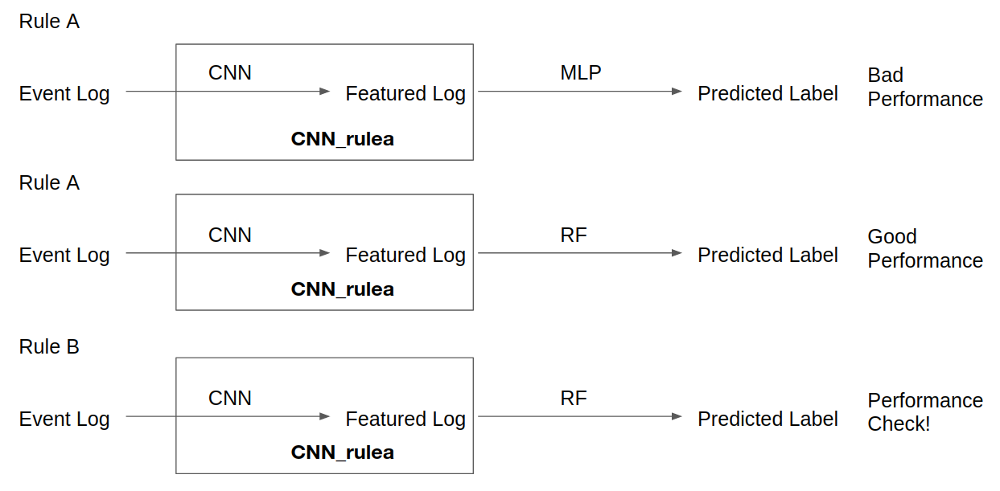

# Outcome oriented prediction with CNN

## Purpose
Event log outcome predicition with CNN

## Update
20.07.29
- Idea with combine CNN layer and random forest works well as in [figure](#0729research)

<a name="0729research"> fig: 07.29 experiment </a> 

- Following question is due to classification is too eay, more complicate situation is required to test
- Also still not sure CNN works as intended, extracting right features for binary classification.
- To check this question with CNN from Rule A, redo exepriment in same setting from different label classification by Rule B.
- Expected : If it works well, CNN doesnt' work well. If performance is bad, CNN validates it only compress and extract feature for Rule A.

20.07.28
- BPIC 2015_2 binary classification with CNN and Only MLP don't work well compare to RF.

20.07.27 
- Preprocessing method, last state encoding, done 
- Convert event log already sliced by prefix length to last state encoding with timestamp, continuous attributes, categorical attributes, and outcome labels
- Customdata loader is written 