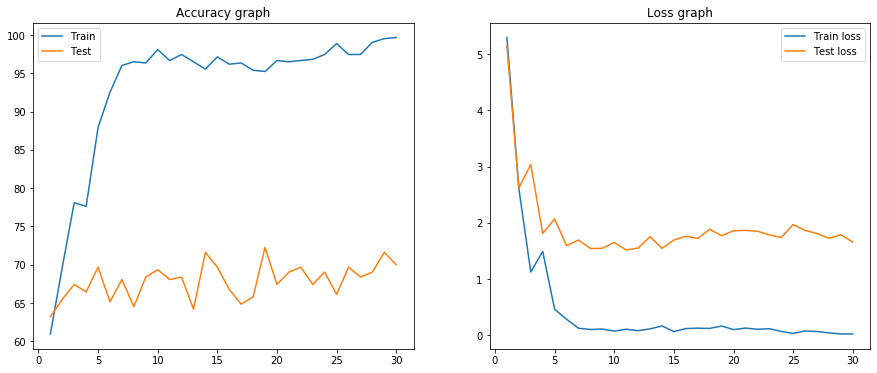
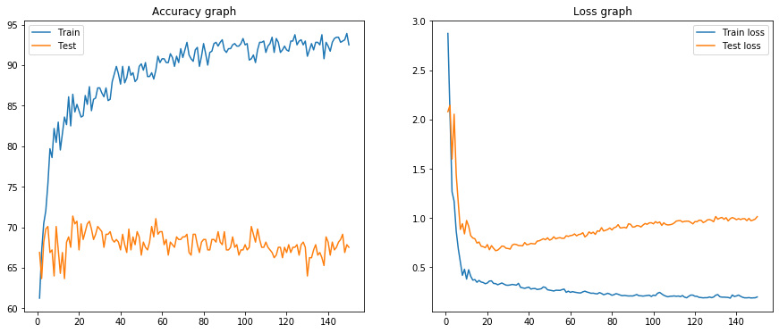
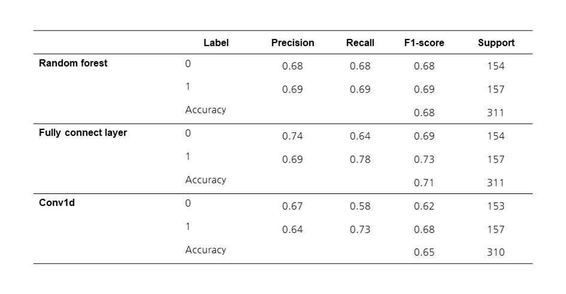

# Outcome oriented prediction with CNN

## Purpose
Event log outcome predicition with CNN

## Update
20.09.01
- CNN1d also shows no further improvement in performance.
- Lets try to change dataset and use longer prefix length

CNN1d result

20.08.31
- Try to change model of FC and CNN1d to be simpler than previous one.
- Even with simplifed model, validation loss didn't decrease even with decreasing training loss in CNN1d model.
- On the other hand, FC model, validation loss value is reduced in early stage while validation accuracy stays after around epoch 20.

FC result

20.08.27
- Fully connected network (FC) and Convolutional 1d network (CNN1d)with index base encoding done
- This time only consider event attributes including continuous and categorical ones.
- Compare RF, FC, CNN1d in binary label classification performance
- There are not that significant difference among those. 
- FC and CNN1d overfitting are found. Validation loss doesn't decrease
- Need to think parameter tunning or redesign network could imporve result. 

20.08.24
- Index base encoding pre-processing file uploaded
- BPIC 2011 with prefix 5 will be the test case for experiment
- Continuous columns are standardized to prevent bias

20.08.06
- Changing output layers but it was not problem. 
- Data imbalance was not the problem.
- Let's consider attach embedding layer, since almost all input data is one hot vector. 
- It worked!. In case of last state encoding, after equalizing input size, i.e., removing columns doesn't exist across all cases.
- After embedding layer before linear layers is efficient that just one hot vector

20.07.29
- Idea with combine CNN layer and random forest works well as in [figure](#0729research)

 

- Following question is due to classification is too eay, more complicate situation is required to test
- Also still not sure CNN works as intended, extracting right features for binary classification.
- To check this question with CNN from Rule A, redo exepriment in same setting from different label classification by Rule B.
- Expected : If it works well, CNN doesnt' work well. If performance is bad, CNN validates it only compress and extract feature for Rule A.

20.07.28
- BPIC 2015_2 binary classification with CNN and Only MLP don't work well compare to RF.

20.07.27 
- Preprocessing method, last state encoding, done 
- Convert event log already sliced by prefix length to last state encoding with timestamp, continuous attributes, categorical attributes, and outcome labels
- Customdata loader is written 
